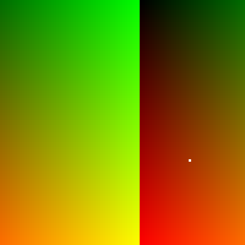

# Day 2

The earilest obscure elven machine code emulator question in Advent of Code history! Pretty easy but took a lot of reading. On the first part, I forgot to make the replacements the first time, so I lost a minute.

The second part was easy given the first part, and I took it by faith that I'd be able to brute force it since it's barely the second day. Plus a cheeky println at the end.

## Visualization

Each `(x,y)` pixel is a `(verb,noun)` pair, with the amount of green representing `output % 100` and red representing just `output`. The white pixel is 19,690,720.

## Fast solution

The solution can be found by running the program while keeping track of where `noun` and `verb` are going, seeing what the first element is at the end depending on `noun` and `verb`, and then inverting the function to find out which `noun` and `verb` belong to the goal output, 19690720. I tried to get a working formula for my input but couldn't get it to work.
