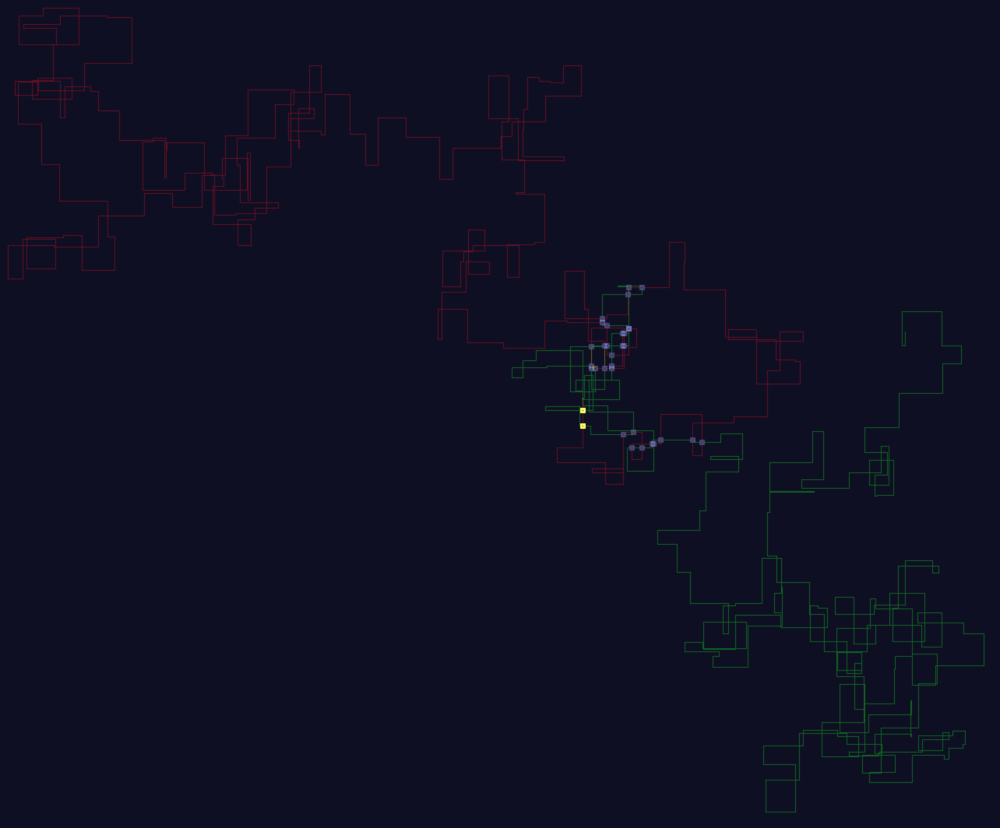
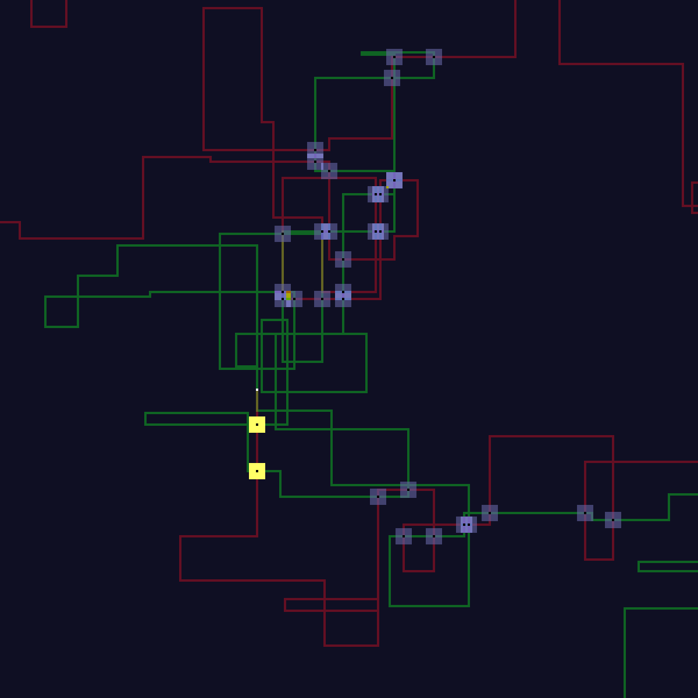

# Day 3

Just slapped two hash maps against each other and printed what fell out.

## Visualization

Here we have the first wire in red and the second wire in green. Both colors are good Christmas colors and good wire colors.

Intersections are grey, the starting point is white, and the two answers are yellow. It has been scaled down 16x with 2x2 pixels for readability.

Here is the center area:

The yellow lines are simply very close and not actually coincident.
