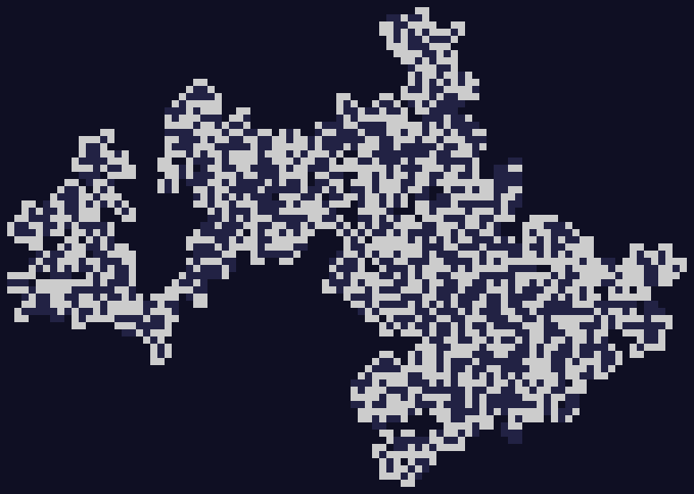

# Day 11

Another Intcode, right on schedule. This one involved writing to a very large address, which meant I had to replace the Vec of ints with a HashMap of ints. Did it though, so we're good to go again.

A big pic of part 1:

Animations for today's part 1: a [slow version](day11.mp4) and a [fast version](day11fast.mp4).
